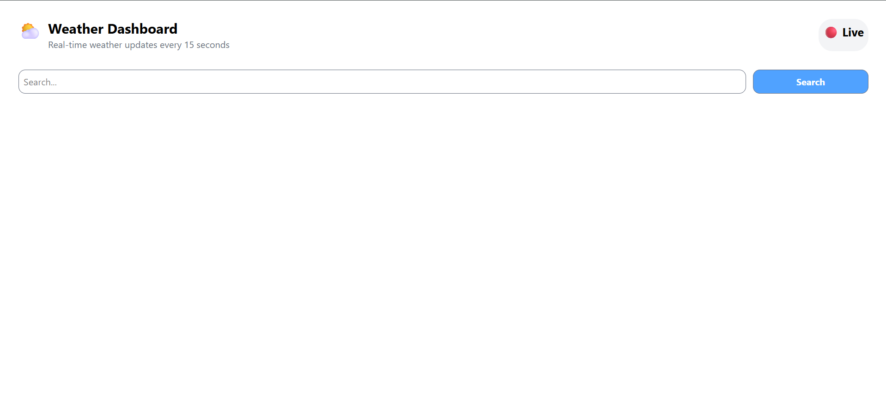
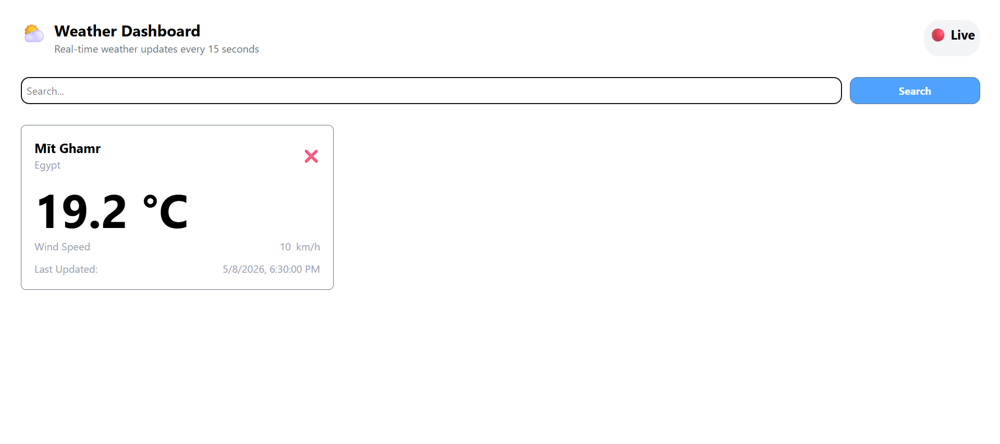
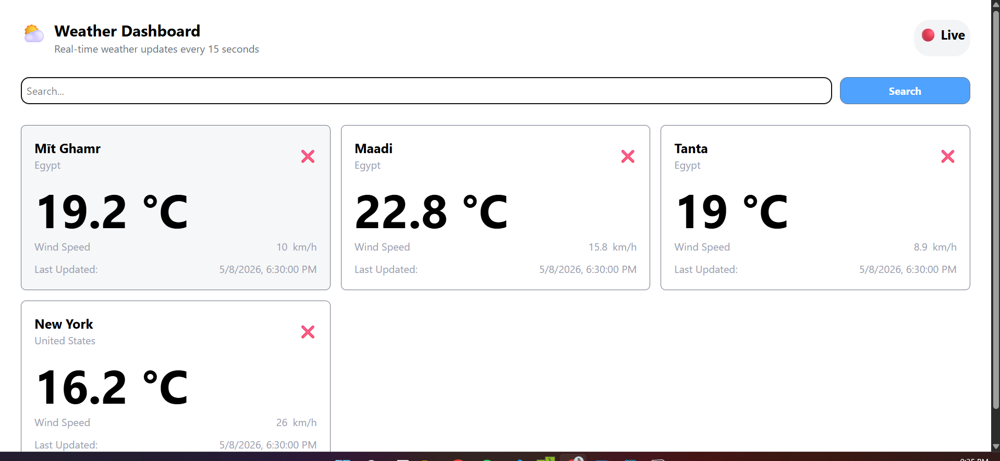
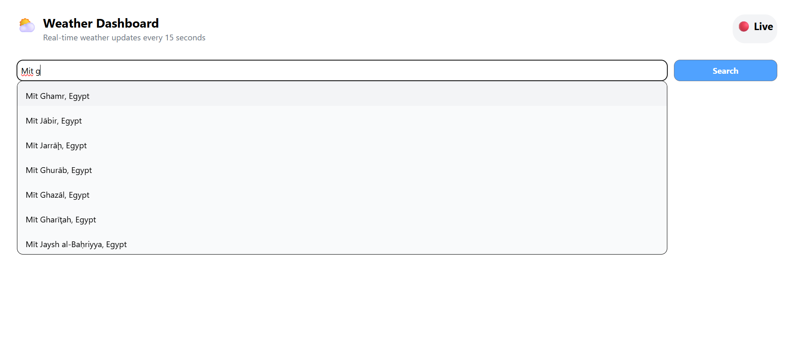
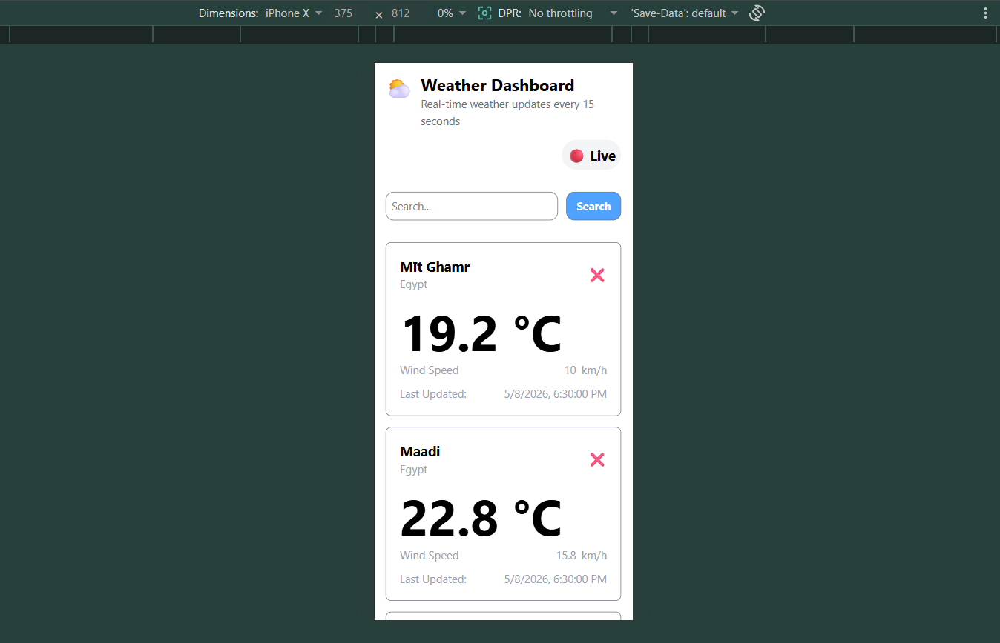

# Weather Dashboard

A React weather dashboard that allows users to search for cities and view real-time weather information using the Open-Meteo API.

---

## Overview

This project is a simple weather application built with React.  
It lets users search for cities, select a location, and display current weather data such as temperature and wind speed.  
Users can also manage a list of multiple cities and remove any city from the dashboard.

---

## Features

- Search for cities with live autocomplete
- Display real-time weather data
- Add multiple cities to dashboard
- Remove cities from list
- Prevent duplicate cities
- Responsive design for all screen sizes
- Error handling with toast notifications

---

## Tech Stack

- React
- JavaScript (ES6+)
- Tailwind CSS
- React Hooks (useState, useEffect)
- React Hot Toast
- Open-Meteo API

---

## APIs Used

### Geocoding API
Used to search for cities by name:

https://geocoding-api.open-meteo.com/v1/search

---

### Weather API
Used to get real-time weather data:

https://api.open-meteo.com/v1/forecast

---

### Author 
Mohamed Mahmoud

---

## Screenshots

### Home Page

### Weather Card

### Responsive

